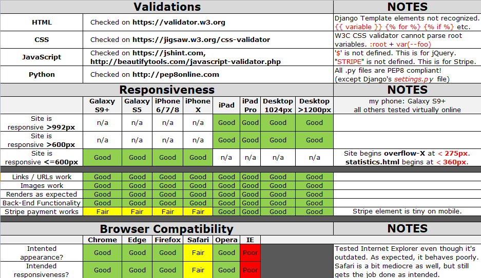

# [Unicorn Attractor](https://unicorn-attractor-2bn.herokuapp.com/)

 

 

   

Welcome to the new and exciting Augmented Reality (AR) app - **Unicorn Attractor**!

**Unicorn Attractor** allows players to explore the world while on the search for magical Unicorns. Once you've downloaded the app (*available on Android and iOS devices*), you'll be able to use your mobile phone's GPS to locate, snatch, and train virtual Unicorns! As you build your Unicorn herd with your fellow Bronies, you'll earn more XP.

This exciting app helps to promote physical activity in the outdoors, combined with the virtual world of *Equestria* through your mobile phone. If you're extremely lucky, perhaps you'll have what it takes to find and snatch the elusive Alicorn! (*Alicorns are winged Unicorns; they have wings like a Pegasus, and a horn like a Unicorn*)

The best part? **Unicorn Attractor** is absolutely free to enjoy with your friends and Bronies!

If you have any issues or requests regarding the the app, please head over to our support page: [Unicorn Attractor Support Page](https://unicorn-attractor-2bn.herokuapp.com/). You'll be able to open two different types of Tickets; *Bugs* and *Features*.

- **BUGS** - If you have any problems or issues using the app, please open a new *Bug* Ticket. Bug requests are always free!
- **FEATURES** - If you think we've missed something, or you'd like to see something added to the app, please open a new *Feature* Ticket. (***NOTE**: Features require a small donation, and can gain more donations if others support your Feature.*)

---

## Table of Contents
1. [**UX**](#ux)
    - [**User Stories**](#user-stories)
    - [**Design**](#design)
        - [**Framework**](#framework)
        - [**Color Scheme**](#color-scheme)
        - [**Icons**](#icons)
        - [**Typography**](#typography)
    - [**Wireframes**](#wireframes)

2. [**Features**](#features)
    - [**Existing Features**](#existing-features)
    - [**Features Left to Implement**](#features-left-to-implement)

3. [**Technologies Used**](#technologies-used)
    - [**Front-End Technologies**](#front-end-technologies)
    - [**Back-End Technologies**](#back-end-technologies)

4. [**Testing**](#testing)
    - [**Validators**](#validators)
    - [**Compatibility**](#compatibility)
    - [**Known Issues**](#known-issues)
    - [**Automated Testing**](#automated-testing)

5. [**Deployment**](#deployment)
    - [**Local Deployment**](#local-deployment)
    - [**Remote Deployment**](#remote-deployment)

6. [**Credits**](#credits)
    - [**Content**](#content)
    - [**Media**](#media)
    - [**Code**](#code)
    - [**Acknowledgements**](#acknowledgements)

---

## UX

This project is part of my [Code Institute](https://codeinstitute.net/) Full Stack Software Development studies, specifically the **Full Stack Frameworks** module. The objective for this milestone project is to "*Create a web application that allows users to submit tickets to an online issue tracker called the **Unicorn Attractor**, where bugs can be submitted for free, but feature requests require a nominal fee*".

*DISCLAIMER: The Unicorn Attractor 'app' does not actually exist for download. The 'app' itself is part of the project concept, whereby the project itself is what I've developed. As exciting as the Unicorn Attractor 'app' sounds, you'll just have to check out these two actual augmented reality apps instead, where my inspiration came from.*

- **[Harry Potter - Wizards Unite](https://www.harrypotterwizardsunite.com)**
- **[Pokémon GO](https://www.pokemongo.com)**

### User Stories

"**_As a user, I would like to_** _____________________________"

- *view the site* from **any device** *(mobile, tablet, desktop)*. :white_check_mark:
- *view all tickets (bugs/features)* as a **Guest**. :white_check_mark:
- *create* my own **profile**. :white_check_mark:
- *update* my **profile**, including *uploading* a **photo**. :white_check_mark:
- *log* my own **bug tickets** for *free*. :white_check_mark:
- *submit* my own **feature requests** for *a small fee*. :white_check_mark:
- *edit* my own **tickets** *(bugs and features)*. :white_check_mark:
- *delete* my own **tickets** *(bugs and features)*. :white_check_mark:
- be able to **log out**. :white_check_mark:
- be able to **change my password**. :white_check_mark:
- *filter and search* amongst all **tickets**. :white_check_mark:
- *see* the **total views** of each *bug and feature*. :white_check_mark:
- *comment* on **bugs and features** that I relate to. :white_check_mark:
- *upvote* **bugs** for *free* that I relate to. :white_check_mark:
- *pay a nominal fee to upvote* **features** that I support. :white_check_mark:
- *view* **statistics** of tickets such as "*most upvotes received*". :white_check_mark:
- *earn* various **badges** for *active participation* using the app. :x:

:white_check_mark: *denotes items that have been successfully implemented*

:x: *denotes items that have not been implemented yet*

### Design

Since the app is called **Unicorn Attractor**, I figured *cute* and *full of colorful rainbows* would match the overall theme. In addition, there are plenty of *unicorns* across the site.

#### Framework

- [Materialize 1.0.0](https://materializecss.com/)
    - I really like the modern and clean layout of Materialize as a framework, with its simple-to-understand documentation.
- [jQuery 3.4.1](https://code.jquery.com/jquery/)
    - In an effort to keep the JavaScript minimal, I have decided to use jQuery as foundation to my scripts framework.
- [Django 1.11.22](https://www.djangoproject.com/download/)
    - Django is a free and open-source web framework that I've used to render the back-end Python with the front-end Materialize.

#### Color Scheme

*Color Palette*: **Ticket Type**

| Bugs | Features |
| :---: | :---: |
|  |  |
| #FD8D14 | #1484FC |

*Color Palette*: **Ticket Status**

| Open | In Progress | Closed |
| :---: | :---: | :---: |
|  |  |  |
| #F44336 | #FFC107 | #4CAF50 |

*Color Palette*: **Top Supports / Donors**

| Gold | Silver | Bronze |
| :---: | :---: | :---: |
|  |  |  |
| #D6AF36 | #A7A7AD | #A77044 |

*Color Palette*: **Rainbow**

| Red | Orange | Yellow | Green | Blue | Indigo | Purple |
| :---: | :---: | :---: | :---: | :---: | :---: | :---: |
|  |  |  |  |  |  |  |
| #F44336 | #FF9800 | #FFEB3B | #4CAF50 | #2196F3 | #3F51B5 | #9C27B0 |

All of these colors (plus a few others) are set at `:root` level within my *CSS file*. This also allows me to reuse my colors as a `class` across the site, instead of having to assign the colors each and every time.

#### Icons

- [Font Awesome 5.8.2](https://fontawesome.com/)
    - Although *Materialize Icons* have nearly 1,000 free-to-use icons, I prefer the look of the *Font Awesome* icons, and they significantly more icons to use. They aren't displayed using *text*, but rather *classes*, so use on mobile devices isn't affected.

#### Typography

- [Google Fonts](https://fonts.google.com/)
    - [Open Sans](https://fonts.google.com/specimen/Open+Sans) : default font across the entire site.
    - [Dosis](https://fonts.google.com/specimen/Dosis) : font used for *Unicorn Attractor* logo text.
    - [Fontdiner Swanky](https://fonts.google.com/specimen/Fontdiner+Swanky) : font used for larger headers.
    - [Londrina Solid](https://fonts.google.com/specimen/Londrina+Solid) : font used for smaller headers.

### Wireframes

For my wireframes, I started with simple pencil and paper sketches. Once satisfied with the initial sketches, I built mockup concept wireframes using [Balsamiq Wireframes](https://balsamiq.com/) for a couple reasons:
- Code Institute have provided all students with free access until the end of 2019.
- The simplicity and ease of use in a quick and effective manner.

All of my wireframes for this project can be found in the **design** folder, which contains both the [balsamiq](design/wireframes/balsamiq/?raw=true) and [sketches](design/wireframes/sketches/?raw=true) sub-directories respectively.

##### back to [top](#table-of-contents)

---

## Features

In accordance to the project brief, I have successfully implemented all of the *required* features, as well as quite a few additional features to improve user experience!

### Existing Features

**Register Account**
- Anybody can register for free and create their own unique account. This is built using Django's authentication and authorization to validate profile data. Passwords are hashed for security purposes!

**Change Password**
- Users can update their passwords from their profile page. They will receive an email with instructions on how to reset the password.

**Add Profile Picture**
- In addition to updating their profile, users can upload a photo to use as their avatar. All images are cropped and resized to a 300px square in order to minimize file size being stored on AWS, since avatars are displayed small anyway.

**View All Tickets**
- On the *tickets* page, all Tickets are initially displayed in a 'last edit date' order, with a standard 6-items per page using pagination.

**Filtering Tickets**
- If a user would like to narrow-down the number of tickets displayed, they can easily filter tickets using a few different options. Filter can by done by ticket type (bug vs feature), by ticket status (open, in progress, closed), minimum/maximum number of ticket views, or by minimum/maximum number of upvotes received.

**Add a Ticket**
- Opening a new ticket comes in two varieties; Bugs and Tickets. Both require two minimal items: a Ticket Title and Description. For Features, however, there is a minimum donation required which allows users to slide the donation amount with a minimum of €5 and maximum of €100. The secure Stripe API allows users to pay for these donations.

**View a Ticket**
- Whether it's a Bug or a Feature, users can view all tickets individually, regardless of their ticket status. All ticket details are displayed, including a list of other users who have upvoted/supported the ticket. In addition, any existing comments on the ticket will be displayed to the user.

**Update a Ticket**
- Only the user that created a ticket, can edit the ticket. Exception: the admin (superuser) can also edit any ticket in the database.

**Delete a Ticket**
- Similar to editing tickets, only the user that creates a ticket can edit the ticket. Exception: the admin (superuser) can also delete any ticket in the database, should they be inappropriate and/or offensive.

**Upvote a Ticket**
- If the ticket is a Bug, then anybody can upvote the ticket free of charge. If the ticket is a Feature, then in order to upvote the ticket, a small donation is required. The user can decide how much to donate by using a slider, with a minimum donation required of €5. Payment of the donation is done using the secure Stripe API. If the Feature ticket has met its goal of €100, then any additional upvote henceforth is free of charge.

**Downvote a Ticket**
- If a user no longer supports a ticket, they can downvote it to remove their name from the list of supporters. This is only allowed for tickets that are Bugs, since donations on Features are non-refundable.

**Comment on a Ticket**
- Users can add comments on tickets that they relate to. This is also where they would see updates from the Admin related to the ticket, to offer transparency to users.

**View Statistics**
- On the *statistics* page, a number of lists and charts can be viewed. This includes: a leader board outlining the top 3 supporters, the top 10 most upvoted bugs and features (5 of each), a bar chart showing the number of bugs/features based on ticket status, a pie chart showing the total number of bugs vs features, and a bar chart showing the average number of bugs/features that are edited on a monthly/weekly/daily basis. In addition to the *statistics* page, the *footer* also displays the 5 most recent tickets that have been opened.

**Admin Status**
- As Admin (ie: superuser), there are quite a few additional features across the site that no other user has access to. The navbar has an additional link to the Django Admin Panel. Admin can change the status of any ticket directly from the ticket page (open, in progress, closed). The Admin can also modify or delete any tickets deemed inappropriate.

### Features Left to Implement

**Badge Achievements**
- Ideally, I would've loved to implement a badge system for unlocking different achievements. These would've included awarding a badge for new members, creating your 1st/10th/25th ticket, having a feature reach full donation goal, adding an avatar to your profile, etc.

**Additional Stats**
- I think another statistic that would be great to display would've been *most popular tickets*, which would list the top 5 tickets with the most comments added.

**Delete Account**
- Users should be given the opportunity to delete their account entirely. Currently they can register and edit their data, but not remove it from the database.

##### back to [top](#table-of-contents)

---

## Technologies Used

- 
    - [VS Code](https://code.visualstudio.com/) - Used as my primary IDE for coding.
- 
    - [GitHub](https://github.com/) - Used as remote storage of my code online.
- 
    - [Photoshop CS6](https://www.adobe.com/Photoshop) - Used for editing images.
- 
    - [Balsamiq](https://balsamiq.com/) - Used to design my wireframes.

### Front-End Technologies

- 
    - [HTML5](https://developer.mozilla.org/en-US/docs/Web/Guide/HTML/HTML5) - Used as the base for markup text.
- 
    - [CSS3](https://developer.mozilla.org/en-US/docs/Web/CSS/CSS3) - Used as the base for cascading styles.
- 
    - [jQuery 3.4.1](https://code.jquery.com/jquery/) - Used as the primary JavaScript functionality.
- 
    - [Materialize 1.0.0](https://materializecss.com/) - Used as the front-end framework for layout and design.
- 
    - [Stripe API](https://stripe.com/docs/api?lang=python) - Used to make secured payments on Features.
- 
    - [Amazon AWS-S3](https://aws.amazon.com/) - Used to store *staticfiles* and *media* folders and files.
- 
    - [Chart.js 2.8.0](https://www.chartjs.org/docs/latest/) - Used to render interactive charts and statistics graphs.

### Back-End Technologies

- 
    - [Python 3.6.7](https://www.python.org/) - Used as the back-end programming language.
- 
    - [Django 1.11.22](https://docs.djangoproject.com/en/1.11/) - Used as my Python web framework.
- 
    - [Heroku](https://www.heroku.com) - Used for *"Platform as a Service"* (PaaS) for app hosting.
- 
    - [PostgreSQL 11.4](https://www.postgresql.org/) - Used as relational SQL database plugin via Heroku.

For further details on all Python packages used on this project can be found in the [requirements.txt](project/requirements.txt) file. Each of these is outlined below (click below to expand the dropdown), with the package version and a brief description.

CLICK HERE to expand the full <b>requirements.txt</b> details.

| Package | Version | Description |
| :--- | :--- | :--- |
| boto3 | 1.9.179 | The AWS SDK for Python |
| botocore | 1.12.179 | Foundation for AWS-CLI command line utilities |
| certifi | 2019.3.9 | Collection of Root Certificates for validating the trustworthiness of SSL |
| chardet | 3.0.4 | Universal Character Encoding Detector |
| colorama | 0.2.7 | Cross-platform API to print colored terminal text from Python apps) |
| coverage | 4.5.3 | Tool for measuring code coverage of Python programs |
| dj-database-url | 0.4.2 | Utilizes the 12factor inspired DATABASE_URL environment variable to configure Django apps |
| django-cleanup | 3.2.0 | Automatically deletes old files/images to replace with updated versions |
| django-materializecss-form | 1.1.14 | Django form template tags to work with Materialize CSS |
| django-storages | 1.7.1 | Connects Django to S3 Buckets |
| docutils | 0.14 | Modular system for processing documentation into useful formats |
| gunicorn | 19.7.1 | A Python WSGI HTTP Server for UNIX |
| html5lib | 0.999999999 | A pure-Python library for parsing HTML |
| idna | 2.8 | Suitable replacement for the “encodings.idna” module that comes with the standard Python library |
| jmespath | 0.9.4 | Allows you to declaratively specify how to extract elements from a JSON document |
| olefile | 0.46 | Python package to parse, read and write Microsoft OLE2 files |
| Pillow | 5.3.0 | Adds support for opening, manipulating, and saving many different image file formats |
| postgres | 2.2.2 | High-value abstraction over psycopg2 |
| psycopg2 | 2.7.3.2 | Most popular PostgreSQL database adapter for Python |
| psycopg2-binary | 2.8.3 | Python-PostgreSQL Database Adapter |
| pycurl | 7.43.0.2 | Used to fetch objects identified by a URL from a Python program |
| python-dateutil | 2.6.1 | Provides powerful extensions to the standard datetime module |
| python-dotenv | 0.10.3 | Adds .env support in development and deployments using 12-factor principles |
| pytz | 2018.9 | Brings the Olson tz database into Python |
| requests | 2.22.0 | Makes HTTP requests simpler and more human-friendly |
| s3transfer | 0.2.1 | Python library for managing Amazon S3 transfers |
| six | 1.12.0 | A Python 2 and 3 compatibility library |
| stripe | 2.29.4 | Python library for Stripe’s API |
| urllib3 | 1.25.3 | Powerful, sanity-friendly HTTP client for Python |
| webencodings | 0.5.1 | Character encoding aliases for legacy web content |
| whitenoise | 3.3.1 | Simplifies static file serving for WSGI applications with Django |

##### back to [top](#table-of-contents)

---

## Testing

A thorough mix of automated and manual testing have gone into building the project. In addition to tests, I have validated all files against online validation sites, and checked compatibilities across various modern browsers and devices.

### Validators

**HTML**
- [W3C HTML Validator](https://validator.w3.org)
    - All **28 .html** files checked.
    - **5 .html** files contained minor errors that have since been rectified (*statistics, navbar, ticket_card, ticket_filter, ticket_stats*). [Correction Commit: 416a5e4](https://github.com/TravelTimN/ci-milestone05-fsfw/commit/416a5e483b2b380d4fe8023c34224b74ae772354)
    - **Error**: Attribute `lazyload` not allowed on element `img` at this point. (`lazyload="on"` is not yet fully recognized for loading images)
    - The remaining validation issues are all attributed to Django Templating not being recognized by W3C:
        - **Warning**: Consider adding a `lang` attribute to the `html` start tag to declare the language of this document.
        - **Error**: Non-space characters found without seeing a doctype first. Expected `<!DOCTYPE html>`.
        - **Warning**: This document appears to be written in English. Consider adding `lang="en"` (or variant) to the `html` start tag.
        - **Error**: Element `head` is missing a required instance of child element `title`.
        - **Error**: Bad value ``.

**CSS**
- [W3C CSS Validator](https://jigsaw.w3.org/css-validator/)
    - The W3C Jigsaw validator does not yet recognize root variables, and therefore passes **Parse Errors** (x2). These are used to set global CSS variables, similar to most other programming languages. The two Parse Errors I've received are:
        - `:root`
        - `var(--foo)`
    - I also received 6 **Warnings**:
        - Imported style sheets are not checked in direct input and file upload modes.
    - `-webkit-text-fill-color` is an unknown vendor extension.
    - `-webkit-background-clip` is an unknown vendor extension.
    - `::-webkit-slider-thumb` is an unknown vendor extended pseudo-element.
    - `::-webkit-slider-runnable-track` is an unknown vendor extended pseudo-element.
    - `-webkit-transition` is an unknown vendor extension.

**JavaScript**
- [JShint](https://jshint.com/)
    - *stripe.js* [file](project/static/js/stripe.js):
        - METRICS:
            - There are **4** functions in this file. Function with the largest signature take **1** arguments, while the median is **1**. Largest function has **7** statements in it, while the median is **4**. The most complex function has a cyclomatic complexity value of **2** while the median is **1.5**.
        - UNDEFINED VARIABLES:
            - `Stripe` (used for Stripe API)
    - *scripts.js* [file](project/static/js/scripts.js):
        - METRICS:
            - There are **4** functions in this file. Function with the largest signature take **0** arguments, while the median is **0**. Largest function has **5** statements in it, while the median is **3.5**. The most complex function has a cyclomatic complexity value of **1** while the median is **1**.
        - UNDEFINED VARIABLES:
            - `$` (used for jQuery)
- [Beautify Tools](http://beautifytools.com/javascript-validator.php)
    - *stripe.js* [file](project/static/js/stripe.js):
        - *`Stripe` is not defined.*
    - *scripts.js* [file](project/static/js/scripts.js):
        - *No syntax errors!*

**Python**
- [PEP8 Online](http://pep8online.com/)
    - All **32 .py** files checked.
    - Entirely **PEP8 compliant** with one exception:
        - `settings.py` [file](project/main/settings.py) (the built-in Django settings file has a known issue, but is acceptable to not force a line break)
            - *line too long (>79 characters)* (x4) `AUTH_PASSWORD_VALIDATORS= [{}]`
            

### Compatibility

Full details about compatibility tests can be found in my [testing folder](testing/?raw=true), which includes results from Chrome's DevTools Audit report as well.

To ensure a broad range of users can successfully use the site, I tested it across the 6 major browsers in both desktop and mobile configuration.

- **Chrome** (*v.75.0.3770.142*)
- **Edge** (*v.42.17134.1.0*)
- **Firefox** (*v.68.0.1*)
- **Safari** (*v.12.1.2*)
- **Opera** (v.62.0.3331.99*)
- **Internet Explorer** (*v.11.885.17134.0*)

I have also created a testing matrix ([raw Excel file here](testing/testing-ci-milestone05-fsfw.xlsx?raw=true)).

**Testing Matrix**

**Chrome's DevTools Audit Report**
| Performance | Accessibility | Best Practices | SEO |
| :---: | :---: | :---: | :---: |
| 100% | 84% | 79% | 85% |

### Known Issues

During development, I encountered one semi-urgent issued after making one of my GitHub commits. I quickly opened an *issue* on GitHub so I would remember to revisit this problem and resolve it.

- [Reset Password functionality [broken]](https://github.com/TravelTimN/ci-milestone05-fsfw/issues/6)
    - This was fixed and pushed with [commit 39749a2](https://github.com/TravelTimN/ci-milestone05-fsfw/commit/39749a2915272ab21aae0b9f82c9d75724f7dc3e).

### Automated Testing

With Django's built-in `unittest` library module and `TestCase` subclass, I built **27** different tests to encompass most of my python *views*, *forms*, and *models*. Using the [coverage.py](https://coverage.readthedocs.io/en/v4.5.x/) test package, those 27 tests have provided an overall result of **75% test coverage**, which is within the approved minimum requirement for testing. All tests pass as '*OK*'! Most of the remaining Python that I didn't manually build tests for, are built-in Django boilerplates and core functionality. Below is a full table with the entire breakdown of the **Coverage Report** - click to expand the dropdown menu.

CLICK HERE to expand the full <b>Coverage Report</b>

| **Name** | **Stmts** | **Miss** | **Branch** | **BrPart** | **Cover** |
| :--- | ---: | ---: | ---: | ---: | ---: |
| *accounts/__ init __* | 0 | 0 | 0 | 0 | **100%** |
| *accounts/admin* | 3 | 0 | 0 | 0 | **100%** |
| *accounts/apps* | 3 | 3 | 0 | 0 | **0%** |
| *accounts/backends* | 18 | 14 | 4 | 0 | **18%** |
| *accounts/forms* | 45 | 2 | 6 | 2 | **92%** |
| *accounts/models* | 34 | 8 | 8 | 3 | **74%** |
| *accounts/tests* | 61 | 0 | 0 | 0 | **100%** |
| *accounts/urls* | 4 | 0 | 0 | 0 | **100%** |
| *accounts/urls_reset* | 4 | 0 | 0 | 0 | **100%** |
| *accounts/views* | 59 | 27 | 22 | 5 | **51%** |
| *custom_storages* | 6 | 0 | 0 | 0 | **100%** |
| *main/__ init __* | 0 | 0 | 0 | 0 | **100%** |
| *main/settings* | 55 | 4 | 6 | 3 | **89%** |
| *main/urls* | 11 | 1 | 2 | 1 | **85%** |
| *main/wsgi* | 4 | 4 | 0 | 0 | **0%** |
| *manage* | 13 | 6 | 2 | 1 | **53%** |
| *stats/__ init __* | 0 | 0 | 0 | 0 | **100%** |
| *stats/admin* | 1 | 0 | 0 | 0 | **100%** |
| *stats/apps* | 3 | 3 | 0 | 0 | **0%** |
| *stats/models* | 1 | 0 | 0 | 0 | **100%** |
| *stats/tests* | 6 | 0 | 0 | 0 | **100%** |
| *stats/urls* | 3 | 0 | 0 | 0 | **100%** |
| *stats/views* | 35 | 0 | 20 | 0 | **100%** |
| *tickets/__ init __* | 0 | 0 | 0 | 0 | **100%** |
| *tickets/admin* | 7 | 0 | 0 | 0 | **100%** |
| *tickets/apps* | 3 | 3 | 0 | 0 | **0%** |
| *tickets/context_processors* | 13 | 1 | 2 | 1 | **87%** |
| *tickets/forms* | 17 | 0 | 0 | 0 | **100%** |
| *tickets/models* | 46 | 3 | 0 | 0 | **93%** |
| *tickets/tests* | 83 | 0 | 0 | 0 | **100%** |
| *tickets/urls* | 3 | 0 | 0 | 0 | **100%** |
| *tickets/views* | 173 | 77 | 32 | 5 | **51%** |
| --- | --- | --- | --- | --- | --- |
| **TOTAL** | **714** | **156** | **104** | **21** | **75%** |

In addition to the `TestCase` and **coverage.py** tests, I have used [Travis-CI](https://travis-ci.org/) to test Continuous Integration. I had quit the problem initially due to the fact that my primary project sits in a sub-directory called *project* and not at the top-level, which is where there were quite a few various commits on 26th July, but ultimately got it sorted with a successful *passing build* badge.
- 
- *NOTE: this is a live/active badge, showing 'passing' at time of project submission!)*

##### back to [top](#table-of-contents)

---

## Deployment

### Local Deployment

*pending*

### Remote Deployment

*pending*

##### back to [top](#table-of-contents)

---

## Credits

### Content

- [TinyPNG](https://tinypng.com/) - Used to compress images for faster loading.
- [UI Faces](https://uifaces.co) - Used to create generic fake profile avatars.
- [Mini Web Tool](https://www.miniwebtool.com/django-secret-key-generator/) - Used to generate a Django Secret Key.
- [Shields.io](https://shields.io) - Used to create markdown badges for my README.
- [ERD Plus](https://erdplus.com) - Used to create my relational database schema.

### Media

*pending*

### Code

*pending*

### Acknowledgements

- [Ignatius Ukwuoma](https://github.com/ignatiusukwuoma)
    - My Code Institute mentor.
- [Chris Quinn](https://github.com/10xOXR)
    - My accountability partner on all projects.

##### back to [top](#table-of-contents)